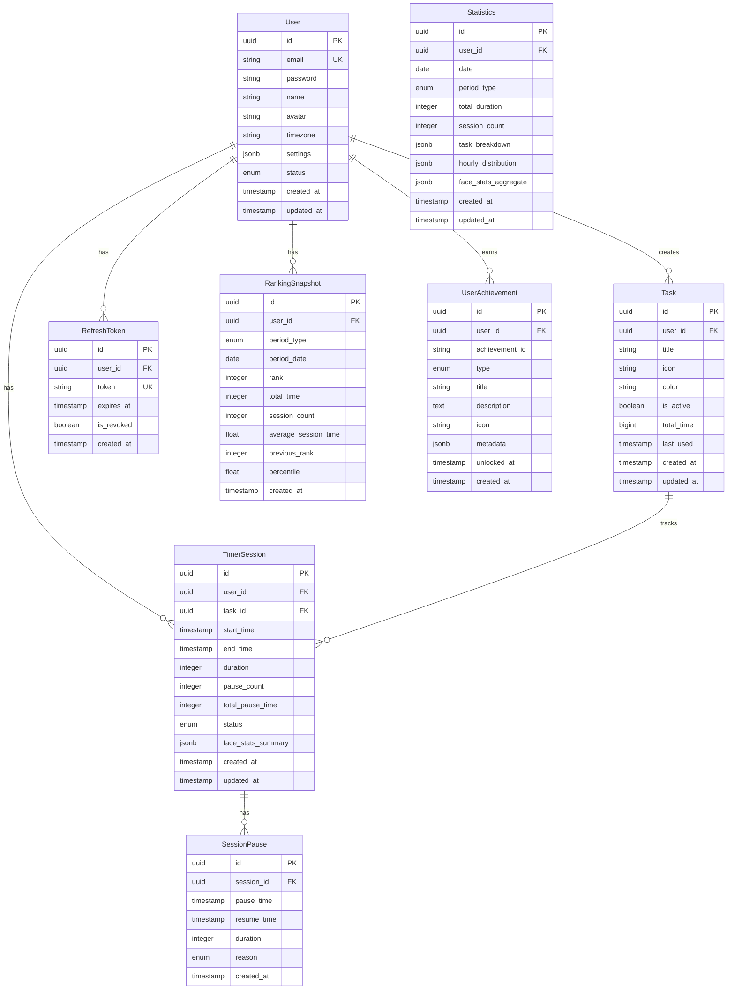

# 데이터베이스 스키마 설계

## 📌 개요

WP Face Timer는 PostgreSQL을 메인 데이터베이스로 사용하며, TypeORM을 통해 엔티티를 관리합니다.

## 🗄️ ERD (Entity Relationship Diagram)



## 📋 엔티티 정의

### 1. User (사용자)

```typescript
@Entity('users')
export class User {
  @PrimaryGeneratedColumn('uuid')
  id: string;

  @Column({ unique: true })
  @Index()
  email: string;

  @Column()
  password: string; // bcrypt hashed

  @Column()
  name: string;

  @Column({ nullable: true })
  avatar: string;

  @Column({ default: 'UTC' })
  timezone: string;

  @Column('jsonb', { default: {} })
  settings: {
    autoStartTimer: boolean;
    breakReminder: boolean;
    breakInterval: number;  // minutes
    dailyGoal: number;      // minutes
    notifications: {
      email: boolean;
      push: boolean;
    };
  };

  @Column({
    type: 'enum',
    enum: ['ACTIVE', 'INACTIVE', 'SUSPENDED'],
    default: 'ACTIVE'
  })
  status: string;

  @CreateDateColumn()
  createdAt: Date;

  @UpdateDateColumn()
  updatedAt: Date;

  // Relations
  @OneToMany(() => Task, task => task.user)
  tasks: Task[];

  @OneToMany(() => TimerSession, session => session.user)
  sessions: TimerSession[];
}
```

### 2. Task (작업)

```typescript
@Entity('tasks')
@Index(['userId', 'isActive'])
export class Task {
  @PrimaryGeneratedColumn('uuid')
  id: string;

  @Column('uuid')
  @Index()
  userId: string;

  @Column()
  title: string;

  @Column({ nullable: true })
  icon: string;

  @Column({ nullable: true })
  color: string;

  @Column({ default: true })
  isActive: boolean;

  @Column('bigint', { default: 0 })
  totalTime: number; // milliseconds

  @Column({ type: 'timestamp', nullable: true })
  lastUsed: Date;

  @CreateDateColumn()
  createdAt: Date;

  @UpdateDateColumn()
  updatedAt: Date;

  // Relations
  @ManyToOne(() => User, user => user.tasks, { onDelete: 'CASCADE' })
  @JoinColumn({ name: 'user_id' })
  user: User;

  @OneToMany(() => TimerSession, session => session.task)
  sessions: TimerSession[];
}
```

### 3. TimerSession (타이머 세션)

```typescript
@Entity('timer_sessions')
@Index(['userId', 'startTime'])
@Index(['taskId', 'startTime'])
@Index(['status'])
export class TimerSession {
  @PrimaryGeneratedColumn('uuid')
  id: string;

  @Column('uuid')
  userId: string;

  @Column('uuid')
  taskId: string;

  @Column('timestamp')
  startTime: Date;

  @Column('timestamp', { nullable: true })
  endTime: Date;

  @Column({ type: 'integer', default: 0 })
  duration: number; // seconds

  @Column({ type: 'integer', default: 0 })
  pauseCount: number;

  @Column({ type: 'integer', default: 0 })
  totalPauseTime: number; // seconds

  @Column({
    type: 'enum',
    enum: ['ACTIVE', 'PAUSED', 'COMPLETED', 'CANCELLED'],
    default: 'ACTIVE'
  })
  @Index()
  status: string;

  @Column('jsonb', { nullable: true })
  faceStatsSummary: {
    averageAttention: number;
    averageConfidence: number;
    drowsyPercentage: number;
    fatigueBreakdown: {
      low: number;
      medium: number;
      high: number;
    };
    emotionBreakdown: Record<string, number>;
  };

  @CreateDateColumn()
  createdAt: Date;

  @UpdateDateColumn()
  updatedAt: Date;

  // Relations
  @ManyToOne(() => User, user => user.sessions, { onDelete: 'CASCADE' })
  @JoinColumn({ name: 'user_id' })
  user: User;

  @ManyToOne(() => Task, task => task.sessions, { onDelete: 'CASCADE' })
  @JoinColumn({ name: 'task_id' })
  task: Task;

  @OneToMany(() => SessionPause, pause => pause.session)
  pauses: SessionPause[];
}
```

### 4. SessionPause (세션 일시정지)

```typescript
@Entity('session_pauses')
@Index(['sessionId', 'pauseTime'])
export class SessionPause {
  @PrimaryGeneratedColumn('uuid')
  id: string;

  @Column('uuid')
  sessionId: string;

  @Column('timestamp')
  pauseTime: Date;

  @Column('timestamp', { nullable: true })
  resumeTime: Date;

  @Column({ type: 'integer', nullable: true })
  duration: number; // seconds

  @Column({
    type: 'enum',
    enum: ['MANUAL', 'FACE_NOT_DETECTED', 'BREAK', 'SYSTEM'],
    default: 'MANUAL'
  })
  reason: string;

  @CreateDateColumn()
  createdAt: Date;

  // Relations
  @ManyToOne(() => TimerSession, session => session.pauses, { onDelete: 'CASCADE' })
  @JoinColumn({ name: 'session_id' })
  session: TimerSession;
}
```

### 5. RefreshToken (리프레시 토큰)

```typescript
@Entity('refresh_tokens')
@Index(['token'])
@Index(['userId', 'isRevoked'])
export class RefreshToken {
  @PrimaryGeneratedColumn('uuid')
  id: string;

  @Column('uuid')
  userId: string;

  @Column({ unique: true })
  token: string;

  @Column('timestamp')
  expiresAt: Date;

  @Column({ type: 'boolean', default: false })
  isRevoked: boolean;

  @CreateDateColumn()
  createdAt: Date;

  // Relations
  @ManyToOne(() => User, { onDelete: 'CASCADE' })
  @JoinColumn({ name: 'user_id' })
  user: User;
}
```

### 7. RankingSnapshot (랭킹 스냅샷)

```typescript
@Entity('ranking_snapshots')
@Index(['periodType', 'periodDate'])
@Index(['userId', 'periodType', 'periodDate'])
export class RankingSnapshot {
  @PrimaryGeneratedColumn('uuid')
  id: string;

  @Column('uuid')
  userId: string;

  @Column({
    type: 'enum',
    enum: ['daily', 'weekly', 'monthly'],
  })
  periodType: string;

  @Column('date')
  periodDate: Date;  // 기간의 시작 날짜

  @Column({ type: 'integer' })
  rank: number;

  @Column({ type: 'integer' })
  totalTime: number;  // seconds

  @Column({ type: 'integer' })
  sessionCount: number;

  @Column({ type: 'float' })
  averageSessionTime: number;

  @Column({ type: 'integer', nullable: true })
  previousRank: number;  // 이전 기간 순위

  @Column({ type: 'float' })
  percentile: number;  // 상위 몇 %

  @CreateDateColumn()
  createdAt: Date;

  // Relations
  @ManyToOne(() => User, { onDelete: 'CASCADE' })
  @JoinColumn({ name: 'user_id' })
  user: User;
}
```

### 8. UserAchievement (사용자 업적)

```typescript
@Entity('user_achievements')
@Index(['userId', 'unlockedAt'])
export class UserAchievement {
  @PrimaryGeneratedColumn('uuid')
  id: string;

  @Column('uuid')
  userId: string;

  @Column()
  achievementId: string;

  @Column({
    type: 'enum',
    enum: ['first_place', 'top_10', 'top_100', 'streak', 'milestone'],
  })
  type: string;

  @Column()
  title: string;

  @Column('text')
  description: string;

  @Column({ nullable: true })
  icon: string;

  @Column('jsonb', { nullable: true })
  metadata: {
    period?: string;  // daily, weekly, monthly
    value?: number;  // 연속 일수, 달성 시간 등
  };

  @Column('timestamp')
  unlockedAt: Date;

  @CreateDateColumn()
  createdAt: Date;

  // Relations
  @ManyToOne(() => User, { onDelete: 'CASCADE' })
  @JoinColumn({ name: 'user_id' })
  user: User;
}
```

### 9. Statistics (통계 - 집계 테이블)

```typescript
@Entity('statistics')
@Index(['userId', 'date', 'periodType'])
@Index(['date'])
export class Statistics {
  @PrimaryGeneratedColumn('uuid')
  id: string;

  @Column('uuid')
  userId: string;

  @Column('date')
  date: Date;

  @Column({
    type: 'enum',
    enum: ['DAILY', 'WEEKLY', 'MONTHLY'],
    default: 'DAILY'
  })
  periodType: string;

  @Column({ type: 'integer', default: 0 })
  totalDuration: number; // seconds

  @Column({ type: 'integer', default: 0 })
  sessionCount: number;

  @Column('jsonb', { nullable: true })
  taskBreakdown: Array<{
    taskId: string;
    taskTitle: string;
    duration: number;
    percentage: number;
  }>;

  @Column('jsonb', { nullable: true })
  hourlyDistribution: Array<{
    hour: number;
    duration: number;
  }>;

  @Column('jsonb', { nullable: true })
  faceStatsAggregate: {
    averageAttention: number;
    averageConfidence: number;
    drowsyPercentage: number;
    emotionBreakdown: Record<string, number>;
    fatigueDistribution: {
      low: number;
      medium: number;
      high: number;
    };
  };

  @CreateDateColumn()
  createdAt: Date;

  @UpdateDateColumn()
  updatedAt: Date;

  // Relations
  @ManyToOne(() => User, { onDelete: 'CASCADE' })
  @JoinColumn({ name: 'user_id' })
  user: User;
}
```

## 🔑 인덱싱 전략

### 주요 인덱스

1. **User 테이블**
   - `email` (UNIQUE): 로그인 시 빠른 조회
   - `status`: 활성 사용자 필터링

2. **Task 테이블**
   - `(userId, isActive)`: 사용자별 활성 작업 조회
   - `userId`: 사용자의 모든 작업 조회

3. **TimerSession 테이블**
   - `(userId, startTime)`: 사용자별 세션 시간순 조회
   - `(taskId, startTime)`: 작업별 세션 조회
   - `status`: 활성 세션 필터링

4. **Statistics 테이블**
   - `(userId, date, periodType)`: 특정 기간 통계 조회
   - `date`: 날짜별 통계 조회

## 🔄 마이그레이션 전략

### 초기 마이그레이션

```bash
# TypeORM CLI를 사용한 마이그레이션 생성
npm run migration:create -- InitialSchema

# 마이그레이션 실행
npm run migration:run

# 마이그레이션 되돌리기
npm run migration:revert
```

### 마이그레이션 예시

```typescript
import { MigrationInterface, QueryRunner } from "typeorm";

export class InitialSchema1234567890123 implements MigrationInterface {
    public async up(queryRunner: QueryRunner): Promise<void> {
        // 테이블 생성
        await queryRunner.query(`
            CREATE TABLE "users" (
                "id" uuid PRIMARY KEY DEFAULT uuid_generate_v4(),
                "email" varchar(255) NOT NULL UNIQUE,
                "password" varchar(255) NOT NULL,
                "name" varchar(255) NOT NULL,
                "avatar" varchar(255),
                "timezone" varchar(100) DEFAULT 'UTC',
                "settings" jsonb DEFAULT '{}',
                "status" varchar(20) DEFAULT 'ACTIVE',
                "created_at" timestamp DEFAULT CURRENT_TIMESTAMP,
                "updated_at" timestamp DEFAULT CURRENT_TIMESTAMP
            )
        `);

        // 인덱스 생성
        await queryRunner.query(`
            CREATE INDEX "idx_users_email" ON "users" ("email");
            CREATE INDEX "idx_users_status" ON "users" ("status");
        `);

        // 트리거 생성 (updated_at 자동 업데이트)
        await queryRunner.query(`
            CREATE OR REPLACE FUNCTION update_updated_at_column()
            RETURNS TRIGGER AS $$
            BEGIN
                NEW.updated_at = CURRENT_TIMESTAMP;
                RETURN NEW;
            END;
            $$ language 'plpgsql';

            CREATE TRIGGER update_users_updated_at
            BEFORE UPDATE ON users
            FOR EACH ROW
            EXECUTE FUNCTION update_updated_at_column();
        `);
    }

    public async down(queryRunner: QueryRunner): Promise<void> {
        await queryRunner.query(`DROP TABLE "users"`);
    }
}
```

## 🎯 성능 최적화

### 1. 파티셔닝

대용량 데이터 테이블에 대한 파티셔닝 전략:

```sql
-- TimerSession 테이블 월별 파티셔닝 (대량 세션 처리 시)
CREATE TABLE timer_sessions (
    -- columns...
) PARTITION BY RANGE (start_time);

CREATE TABLE timer_sessions_2024_01
    PARTITION OF timer_sessions
    FOR VALUES FROM ('2024-01-01') TO ('2024-02-01');
```

### 2. 집계 테이블

실시간 쿼리 부담을 줄이기 위한 집계 테이블 활용:
- `statistics` 테이블에 일별/주별/월별 집계 데이터 저장
- 배치 작업으로 정기적 업데이트

### 3. 캐싱 전략

Redis를 활용한 캐싱:
- 활성 세션 정보
- 최근 통계 데이터
- 사용자 설정

## 📊 데이터 보존 정책

| 테이블 | 보존 기간 | 아카이빙 전략 |
|--------|----------|--------------|
| User | 영구 | - |
| Task | 영구 | - |
| TimerSession | 2년 | 2년 이상 데이터는 요약 후 삭제 |
| Statistics | 영구 | - |
| RefreshToken | 30일 | 만료 후 30일 뒤 삭제 |

## 🔒 보안 고려사항

1. **민감 정보 암호화**
   - 비밀번호: bcrypt 해싱
   - 개인정보: AES-256 암호화 (필요시)

2. **접근 제어**
   - Row Level Security (RLS) 적용 고려
   - 사용자는 자신의 데이터만 접근 가능

3. **감사 로깅**
   - 중요 작업에 대한 audit_log 테이블 별도 구성

## 🚀 확장성 고려사항

1. **샤딩 준비**
   - user_id 기반 수평 샤딩 가능한 구조

2. **읽기 전용 복제본**
   - 통계 쿼리용 읽기 전용 DB 분리

3. **시계열 데이터 최적화**
   - TimescaleDB 도입 고려 (Statistics, RankingSnapshot)

4. **NoSQL 혼용**
   - 얼굴 인식 원시 데이터는 MongoDB 저장 고려