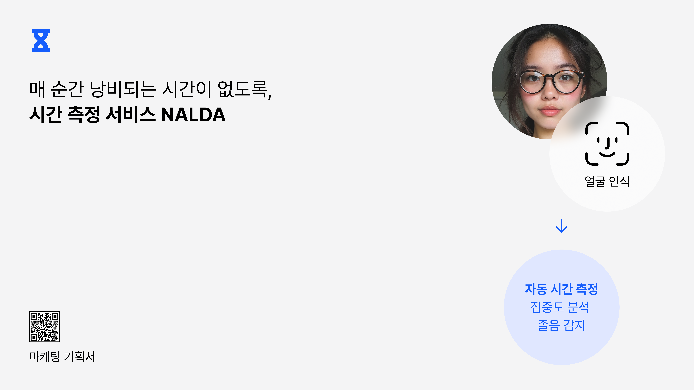
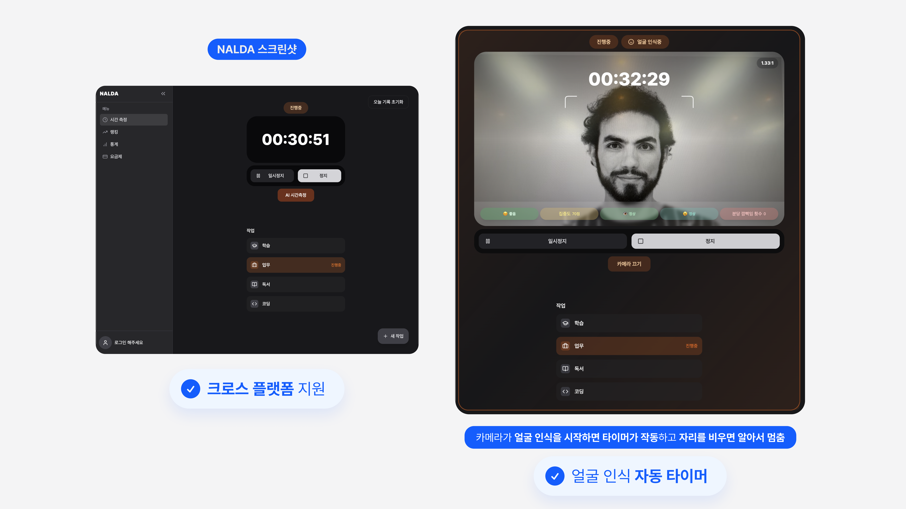

# NALDA Timer



얼굴 인식 기술을 활용한 집중력 관리 및 시간 측정 서비스 (크로스 플랫폼 지원 예정)
## 🎯 데모 (베타)

[NALDA Timer 베타](https://timer.naldadev.com)

> 💡 **참고**: 베타 버전이기 때문에 일부 기능이 제대로 작동하지 않을 수 있습니다.

## 📖 프로젝트 개요

NALDA Timer는 컴퓨터 비전 기술을 활용하여 사용자의 집중도를 실시간으로 모니터링하고 학습/작업 시간을 효율적으로 관리할 수 있도록 도와주는 혁신적인 웹 애플리케이션입니다.

### 🌟 주요 특징

- **🎯 실시간 얼굴 인식**: [@vladmandic/human](https://github.com/vladmandic/human) 라이브러리를 활용한 고정밀 얼굴 감지
- **👁️ 집중도 분석**: 눈 깜빡임, 하품, 시선 방향, 머리 자세 등을 종합 분석
- **⏱️ 스마트 타이머**: 얼굴 감지 따른 자동 일시정지 및 재개
- **🌗 반응형 UI**: 모던하고 직관적인 사용자 인터페이스

### 🎮 핵심 기능

#### 1. 얼굴 기반 집중도 측정
- **눈 깜빡임 분석 (EAR)**: Eye Aspect Ratio를 통한 졸음 감지
- **입 모양 분석 (MAR)**: Mouth Aspect Ratio를 통한 하품 감지
- **시선 추적**: 좌우상하 시선 방향 실시간 분석
- **머리 자세 추정**: Yaw, Pitch, Roll 각도 측정
- **감정 인식**: 감정 상태 분석

#### 2. 스마트 타이머 시스템
- 얼굴이 감지되면 자동으로 타이머 시작
- 얼굴이 감지되지 않으면 자동 일시정지
- 작업별 시간 누적 관리
- 실시간 집중도 점수 표시

## 🚀 시작하기

### 사전 요구사항

- Node.js 20.x (최신 LTS 권장)
- npm 또는 yarn 패키지 매니저
- 웹캠이 있는 컴퓨터
- 모던 웹 브라우저 (Chrome, Firefox, Safari, Edge)

### 설치 방법

1. 저장소 클론
```bash
git clone https://github.com/your-username/face-timer.git
cd face-timer
```

2. 의존성 설치
```bash
# npm 사용시
npm install

# yarn 사용시
yarn
```

3. 개발 서버 실행
```bash
# npm 사용시
npm run dev

# yarn 사용시
yarn dev
```

4. 브라우저에서 `https://localhost:8080` 접속
> ⚠️ **참고**: HTTP 환경에서는 웹캠 기능을 사용할 수 없습니다. HTTPS 환경에서 실행해주세요.


### 빌드 방법

```bash
# 프로덕션 빌드
npm run build

# 개발 빌드
npm run build:dev

# 빌드 결과 미리보기
npm run preview
```

## 📱 사용 방법

### 1. 초기 설정
1. 웹 애플리케이션을 열고 카메라 권한을 허용합니다
2. AI 시간측정 버튼을 클릭했을 때, 화면에 얼굴이 정확히 인식되는지 확인합니다
3. 필요시 카메라 설정에서 적절한 카메라를 선택합니다

### 2. 시간측정 시작
1. 메인 화면에서 AI 시간측정 버튼이나 작업을 클릭하여 시간측정을 시작합니다
2. AI 시간측정 사용 시 얼굴이 인식되면 자동으로 타이머가 시작됩니다
3. AI 시간측정 사용 시 얼굴 인식에 실패하면 타이머가 일시정지됩니다

## 🛠️ 기술 스택

### Frontend
- **React 18**: 컴포넌트 기반 UI 라이브러리
- **TypeScript**: 타입 안전성을 위한 정적 타입 언어
- **Vite**: 빠른 개발 환경 구축 도구
- **Tailwind CSS**: 유틸리티 우선 CSS 프레임워크
- **Framer Motion**: 부드러운 애니메이션 효과

### UI Components
- **Radix UI**: 접근성을 고려한 헤드리스 UI 컴포넌트
- **Shadcn/ui**: 재사용 가능한 UI 컴포넌트 시스템
- **Lucide React**: 일관된 아이콘 라이브러리

### Computer Vision
- **@vladmandic/human**: 고성능 얼굴 인식 및 분석 라이브러리
- **WebGL**: GPU 가속 처리
- **MediaDevices API**: 웹캠 접근 및 제어

### State Management & Routing
- **React Context**: 전역 상태 관리
- **React Router**: 클라이언트 사이드 라우팅

### Data Visualization
- **Recharts**: 반응형 차트 라이브러리
- **Date-fns**: 날짜 처리 유틸리티

## 📊 얼굴 분석 알고리즘

### EAR (Eye Aspect Ratio)
```
EAR = (||p2-p6|| + ||p3-p5||) / (2 * ||p1-p4||)
```
- 눈의 수직 거리와 수평 거리 비율로 눈 감김 정도 측정
- 임계값 이하시 졸음으로 판단

### MAR (Mouth Aspect Ratio)
```
MAR = (||p2-p6|| + ||p3-p5||) / (2 * ||p1-p4||)
```
- 입의 형태 분석을 통한 하품 감지
- 일정 임계값 초과시 하품으로 판단

### 머리 자세 추정
- **Yaw**: 좌우 회전 각도 (-45° ~ +45°)
- **Pitch**: 상하 회전 각도 (-30° ~ +30°)
- **Roll**: 기울기 각도 (-30° ~ +30°)

### 집중도 점수 계산
```
집중도 점수 = 100
            - EAR 패널티
            - MAR 패널티
            - 머리 자세 패널티
            - ((100 - 시선 안정성) × 0.2)
            - 깜빡임 패널티
# (결과는 0 ~ 100 범위로 클램프됩니다)
```

## 🏗️ 프로젝트 구조

```
src/
├── components/          # 재사용 가능한 컴포넌트
│   ├── layout/         # 레이아웃 컴포넌트
│   ├── timer/          # 타이머 관련 컴포넌트
│   ├── tasks/          # 작업 관리 컴포넌트
│   ├── user/           # 사용자 관련 컴포넌트
│   └── ui/             # 기본 UI 컴포넌트
├── contexts/           # React Context 프로바이더
├── hooks/              # 커스텀 훅
├── pages/              # 페이지 컴포넌트
├── types/              # TypeScript 타입 정의
├── utils/              # 유틸리티 함수
└── data/               # 정적 데이터
```


## 🚨 주의사항

- **개인정보 보호**: 얼굴 인식 데이터는 로컬에서만 처리되며 외부 서버로 전송되지 않습니다
- **카메라 권한**: 웹캠 사용을 위해 브라우저에서 카메라 권한을 허용해야 합니다
- **성능**: GPU 가속을 위해 WebGL이 지원되는 브라우저에서 사용하시기 바랍니다
- **조명**: 적절한 조명 환경에서 사용시 더 정확한 얼굴 인식이 가능합니다

## 📚 참고 자료
- vladmandic/human https://github.com/vladmandic/human  
- shadcn/ui https://github.com/shadcn/ui  
- Radix UI https://www.radix-ui.com  
- Framer Motion https://www.framer.com/motion/  
